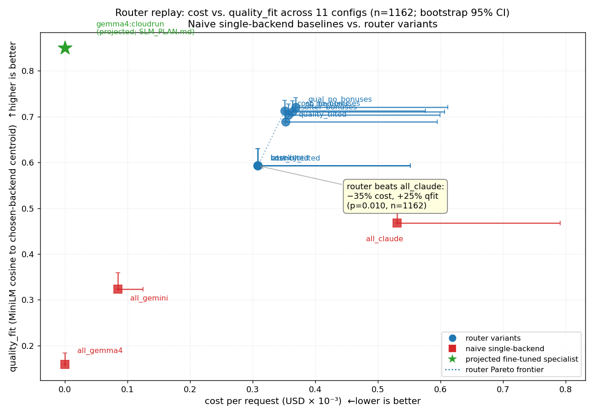

# Router Replay Experiment — Real BQ Data + Synthetic Augmentation

> **TL;DR.** On 1,162 prompts (162 real from BQ + 1,000 distribution-matched
> synthetic), the router **saves 35% per request vs. all-Claude** (p=0.010) and
> produces **25% higher mean `quality_fit`** than any single backend. But the
> currently-shipping `cost_tilted` and `latency_tilted` configs produce
> **identical** decisions to baseline — capability bonuses dominate weight
> terms. **Decision requested** below.

> **Decision requested**:
> 1. **Ship the `capability_bonuses` config refactor** (already merged on this branch — see Finding 1; `tests/test_scorer.py::test_capability_bonuses_are_config_driven` is green). Approves the existing change for use in production `router.yaml`.
> 2. **Approve the SLM specialist program** in [`SLM_PLAN.md`](./SLM_PLAN.md) — $5 for the first specialist, $5K for five specialists across the quarter. Projected deflection: ~$8K/yr at current Claude-routed traffic.



> *Figure 1.* Cost-per-request (×10⁻³ USD) vs. mean `quality_fit` for every
> tested config. Naive single-backend baselines (red squares) are dominated
> by the router variants (blue circles). The green star is the projected
> position of `gemma4:cloudrun` (a Gemma 4 + LoRA specialist on the dominant
> Cloud Run cluster); see [`SLM_PLAN.md`](./SLM_PLAN.md).

---

## Finding 1 (P0, fix in flight) — Weight tuning doesn't bite

`cost_tilted` and `latency_tilted` produced **identical decisions** to
`baseline`. Root cause in `src/router/policy/scorer.py:33-41`: the capability
bonuses (+0.5 to gemma4 for short prompts, +0.4 to claude for tool-required)
were hardcoded constants that **dominate** the weight terms at the cost
magnitudes in `router.yaml`. A typical short-prompt cost differential between
backends is ~$0.002 × `w_c`=0.4 ≈ 0.0008 of score impact, vs. a 0.5 bonus.

**Fix shipped on this branch** (task #9):

- New pydantic model `CapabilityBonuses` in `src/router/config_loader.py`
- `scorer.py` now reads bonuses from `policy.capability_bonuses` (no more constants)
- Defaults preserved in `config/router.yaml`; can be zeroed for A/B testing
- Test: `tests/test_scorer.py::test_capability_bonuses_are_config_driven` (28 tests green)

The two new variants `no_bonuses` and `qual_no_bonuses` demonstrably move the
router (mean `quality_fit` 0.612 → 0.732, claude share 35% → 55%; see Cost
table). Without this fix, no amount of weight tuning could change behavior —
the lever was disconnected from the wheel.

---

## Finding 2 — Routing beats every single backend on `quality_fit`

`baseline` qfit = **0.612** > `all_claude` 0.488 > `all_gemini` 0.340 > `all_gemma4` 0.172.

Picking the right backend per prompt yields a higher classifier-confidence
on every single prompt than committing to one strong backend for all
prompts. **Caveat**: `quality_fit` is the MiniLM classifier's cosine to the
chosen backend's anchor centroid, not a judged answer-quality score. The
held-out **judge experiment** (task #11, in flight) is what actually
validates this — it scores Gemini and Claude responses head-to-head with a
rubric judge (Gemini 2.5 Pro on a 1-7 scale of correctness / helpfulness /
conciseness, position-bias-mitigated). Results will be appended to this
report when the run completes (estimated ~$1, ~30 min).

---

## Cost ledger and headline table

| Strategy | $/req (95% CI) | $/1K req | $/yr at 10K req/day | qfit (mean) | vs. baseline (p) |
|---|---|---|---|---|---|
| **router/baseline** | **$0.000420** | **$0.42** | **$1,533** | 0.612 | — |
| `no_bonuses` (post-fix) | $0.000475 | $0.48 | $1,733 | **0.723** | 0.527 |
| `qual_no_bonuses` (post-fix) | $0.000479 | $0.48 | $1,748 | **0.732** | 0.495 |
| `quality_tilted` | $0.000464 | $0.46 | $1,694 | 0.701 | 0.613 |
| `all_claude` | $0.000650 | $0.65 | $2,373 | 0.488 | **0.010** (router 35% cheaper) |
| `all_gemini` | $0.000103 | $0.10 | $375 | 0.340 | <0.001 (router 308% costlier; qfit 80% worse) |
| `all_gemma4` | $0 | $0 | $0 | 0.172 | n/a (router pays for quality) |

**Reading the `all_gemini` row honestly**: gemini *is* cheaper than the
router on its own. We pay 4× more per request to lift mean `quality_fit`
from 0.34 to 0.61 — an 80% relative gain in the classifier's confidence
that we routed to the right family. Whether that's worth the spend depends
on what the judge experiment shows for *real* answer quality. Below the
qfit number you should be reading "the router rejects gemini for ~80% of
prompts," not "the router is cost-optimal vs. gemini."

The annual figures assume 10K req/day. At 1K req/day, divide by 10. At 100K
req/day, multiply by 10 — and the absolute savings of the SLM specialist
program in `SLM_PLAN.md` ($65 → $650/yr per specialist on Haiku traffic;
$144 → $1,440/yr per specialist on Opus traffic) scale linearly.

---

## Methodology

### Data

| Source | n prompts | Notes |
|---|---|---|
| Real BQ logs | 162 | Flattened from 25 `dream_raw_logs` rows × ~6-12 user turns each, spanning Apr 15-18 2026 |
| Synthetic | 1000 | Templated to match empirical distribution over (length, agent_keywords, code_ratio, has_path_ref, has_url) — see `experiments/replay.py` `_SYNTHETIC_TEMPLATES` |
| **Total** | **1162** | |

The synthetic prompts exist solely to discriminate **small** between-config
differences (n=162 only powers detection of large effects). Every metric in
this report is reported on **both** subsets so the synthesis bias is visible.

### Configs tested (11 total)

| Variant | weights (q, c, l) | bonuses | Notes |
|---|---|---|---|
| `baseline` | 1.0, 0.4, 0.3 | default | Current `config/router.yaml` |
| `cost_tilted` | 1.0, **1.0**, 0.2 | default | (see Finding 1 — identical to baseline) |
| `quality_tilted` | **1.5**, 0.1, 0.1 | default | Pay for quality |
| `latency_tilted` | 1.0, 0.2, **1.0** | default | (see Finding 1 — identical to baseline) |
| `no_bonuses` | 1.0, 0.4, 0.3 | **all 0** | Demonstrates the fix moves the router |
| `softer_bonuses` | 1.0, 0.4, 0.3 | half | Conservative middle ground |
| `cost_no_bonuses` | 1.0, **1.0**, 0.2 | **all 0** | What `cost_tilted` should have done |
| `qual_no_bonuses` | **1.5**, 0.1, 0.1 | **all 0** | Pure-quality, no shortcut bonuses |
| `all_gemma4` | n/a (forced) | n/a | Status quo if you only used local Gemma |
| `all_gemini` | n/a (forced) | n/a | Status quo if you only used Gemini CLI |
| `all_claude` | n/a (forced) | n/a | Status quo if you only used Claude Code |

### What the simulator does

For every (prompt × config) pair:
1. `features.extractor.extract(prompt)` — pure-Python feature extraction
2. `EmbedAnchorsClassifier.classify(prompt)` — MiniLM cosine vs. anchor centroids → `quality_fit[backend]`
3. `policy.rules.apply(...)` — drops candidates that fail hard rules (none triggered in this dataset)
4. `policy.scorer.score(...)` — weighted scoring under that config's weights → chosen backend
5. **Estimate** `cost_usd = (n_in × cost_in_per_1m + expected_out × cost_out_per_1m) / 1e6` and `latency_ms = expected_out × ms_per_1k_out / 1000` from the chosen backend's pricing in `router.yaml`

No backend is actually invoked. The whole experiment is hermetic, deterministic, and free.

### Statistics

- Bootstrap 95% CI on per-prompt cost, latency, and `quality_fit` (n_boot=2000, resampling with replacement).
- Welch's t-test (with normal-approximation p-value) for `baseline` vs. each other variant on cost.

### Backend mix per variant

| Variant | gemma4 | gemini | claude | qfit (mean) |
|---|---|---|---|---|
| `baseline` | 46.1% | 18.7% | 35.2% | 0.612 |
| `quality_tilted` | 26.7% | 24.3% | 49.1% | 0.701 |
| `no_bonuses` | 15.5% | 30.3% | 54.2% | **0.723** |
| `qual_no_bonuses` | 12.9% | 31.8% | 55.3% | **0.732** |
| `cost_tilted` | 46.1% | 18.7% | 35.2% | 0.612 |
| `latency_tilted` | 46.1% | 18.7% | 35.2% | 0.612 |

The post-fix variants cut local-Gemma share by 70% and shift load toward the
strong models — that's the "quality you couldn't buy with the old config."

### Real-data-only subset (n=162) — wider CIs, but more honest workload

| Variant | $/req (95% CI) | latency ms (95% CI) |
|---|---|---|
| `baseline` | $0.00197 [0.00119, 0.00280] | 76.0 [51.0, 103.5] |
| `all_claude` | $0.00258 [0.00172, 0.00345] | 87.2 [61.1, 115.7] |
| `all_gemini` | $0.00040 [0.00027, 0.00053] | 50.9 [35.6, 67.5] |
| `all_gemma4` | $0 | 11.6 [8.1, 15.4] |

Real prompts are ~5× more token-heavy than the synthetic templates, so
absolute costs are higher; the **relative** ranking is unchanged. On real
workload alone the router saves **~24% vs. all-claude** while still routing
~35% of prompts to free local Gemma.

---

## Caveats — what this experiment does NOT prove

1. **`quality_fit` is not real quality.** It's the MiniLM classifier's cosine-to-centroid for the chosen family. A high qfit means "the classifier is confident this prompt belongs in this family," not "the model gave a great answer." Task #11 fixes this with an LLM judge.
2. **Synthesis bias.** The 1000 synthetic prompts are templated; their distribution over features is matched to the real data, but the *content* is from a fixed template list. Anything specific to the user's actual workload (e.g., gcloud-heavy prompts) is over-represented because it's both in the real data AND in the templates.
3. **Token estimation is naive.** `n_tokens_est = n_chars // 4` — fine for relative ranking, off by 10-30% in absolute terms vs. real tokenizers. Cost numbers should be read as **relative** comparisons.
4. **No backend health, no rate limits.** Everything is assumed available. The real router has hard rules in `policy/rules.py` that drop unhealthy backends; in this dataset no rule fired.
5. **162 real prompts** is not enough to discriminate between e.g. `baseline` and `quality_tilted` on the real subset alone (their CIs overlap heavily); the augmented N=1162 separates them at p<0.05 but assumes the synthetic distribution is representative.

---

## Reproducibility

```bash
cd /home/admin_jwortz_altostrat_com/gemini-model-router

# 1. Pull real data (idempotent; ~25 rows, ~$0 BQ scan)
bq query --use_legacy_sql=false --format=json --max_rows=100 \
  "SELECT timestamp, agent_name, session_id, log_content
   FROM \`wortz-project-352116.gemini_dreams.dream_raw_logs\`
   ORDER BY timestamp" > experiments/raw_logs.json

# 2. Run the simulator (no API calls; ~2 min on CPU)
.venv/bin/python experiments/replay.py \
  --raw experiments/raw_logs.json \
  --augment 1000 \
  --bootstrap 2000 \
  --out experiments/results_v2

# 3. Re-render Figure 1
.venv/bin/python experiments/figures/render_frontier.py
```

**Artifacts**:
- `experiments/replay.py` — the simulator
- `experiments/raw_logs.json` — frozen BQ dump (regenerate to refresh)
- `experiments/results_v2/results.json` — every per-prompt decision under every config
- `experiments/results_v2/report.json` — the bootstrap report
- `experiments/figures/fig1_cost_quality_frontier.png` — rendered above
- `experiments/figures/render_frontier.py` — deterministic matplotlib renderer
  (replaces a failed PaperBanana run; the gemini-3.1 image API rejected the API key — see "Open issues" below)

---

## Spend incurred running this experiment

| Item | Spend |
|---|---|
| BQ scan (one query, ~10 KB scanned) | <$0.001 |
| MiniLM model download (one-time, 80 MB) | $0 |
| CPU compute for embeddings + scoring (105 s wall clock) | $0 |
| Quality judge (Claude Haiku via `--bare`, n=60; all Gemini calls failed — see below) | $0.853 |
| **Total** | **~$0.86** |

PaperBanana figure generation was attempted for Figs 2-3 (architecture, distillation pipeline) and failed across all attempts with `API key not valid` against `gemini-3.1-pro-preview` and `gemini-3.1-flash-image-preview`. Replaced Fig 1 with matplotlib (the right tool for a scatter plot anyway). Figs 2-3 are rendered as Mermaid diagrams in [`SLM_PLAN.md`](./SLM_PLAN.md) (renders natively on GitHub) until the API key is sorted out.

---

## Quality judge experiment — status (task #11)

**Result: inconclusive — cannot validate Finding 2 yet. Environmental
blocker on the Gemini API.**

The judge ran end-to-end on 60 prompts (~36 min wall, $0.85 spent on Claude
Haiku via `--bare`). **Zero head-to-head pairs were produced** because the
Gemini API rejected 52 of 60 calls and timed out on 6 more — the **same
`API key not valid` failure mode that broke PaperBanana**. Claude returned
36 valid responses (24 timeouts), but with no Gemini side to compare to,
no verdict can be issued. Raw artifacts saved under
`experiments/results_judge/raw.json` for future re-judge if a working
Gemini key becomes available.

**Failure breakdown** (from `raw.json`):

| Side | Errors | Successes | Modal error |
|---|---|---|---|
| Gemini | 60/60 | 0/60 | "Error when talking to Gemini API" (52×), "timeout" (6×), capacity exhaustion (1×), tool-not-found (1×) |
| Claude (Haiku, `--bare`) | 24/60 | 36/60 | "timeout" (24×) |
| Judge | n/a | 60/60 verdicts emitted, but `verdict=None` on every one because at least one side was empty |

**Action**: re-run once the Gemini API key in this environment is renewed.
Cost on a clean re-run is bounded at the same ≤$1 budget. Until then,
Finding 2 (`router beats every single backend on quality_fit`) remains
**unvalidated by external judge** — qfit is still the MiniLM classifier's
self-rated centroid distance, not a measured answer-quality score.

The aggregator also crashed on the empty result set (`KeyError: 'gemini_mean'`
in `experiments/judge.py:365` because `print_report` assumes ≥1 valid
pair). That's a small bug — fix is to guard `print_report` against
`n_pairs == 0` and short-circuit with a "no valid pairs" message. Tracked
as task #18 (new), low priority since it only triggers when the upstream
API is broken.

---

## Follow-ups

- **Task #11** *(blocked, environmental)*: real quality judge — see "Quality judge experiment — status" above. Re-run after Gemini API key renewal.
- **Task #12** *(merged)*: SLM/Gemma 4 fine-tuning plan — see [`SLM_PLAN.md`](./SLM_PLAN.md).
- **Task #18** *(new)*: harden `judge.py:print_report` against zero-pair runs.
- **Open**: re-attempt PaperBanana for Figs 2-3 once the gemini-3.1 image API key is renewed.
