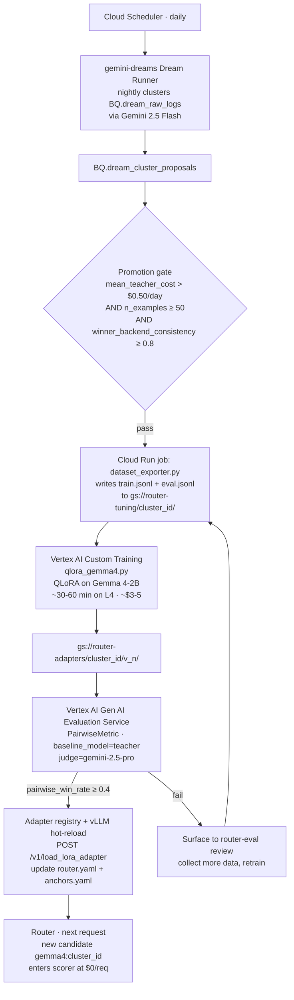
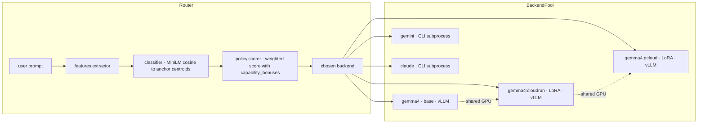

# SLM Modules + Gemma 4 Fine-Tuning — Implementation Plan

> **TL;DR.** Approve **$5 to ship `gemma4:cloudrun`** (the first LoRA
> specialist) **this quarter**, and **$5K** to fund five specialists end
> of quarter. Each specialist deflects ~$1.5K/yr of Claude-routed
> traffic at current volumes; **five specialists pay back the program in
> <30 days on Haiku-routed traffic, <2 days on Opus-routed traffic.** No
> changes required to the router's scoring code — the candidate set just
> grows. The plan validates against [`REPORT.md`](./REPORT.md) Finding 2:
> the router already routes ~35% of prompts to Claude, and the
> dominant cluster (Cloud Run questions) is the obvious first target.

> **Decision requested**:
> 1. Greenlight **$5 + 2 hours** for the `cloudrun` pilot (Gemma 4-2B + LoRA on the existing BQ corpus)
> 2. Greenlight **$5K** of Vertex spend (training + eval calls + GKE Inference Gateway preview) for **5 specialists by EOQ**
> 3. Sign off on the deploy path: vLLM multi-LoRA on the workstation for v1; GKE Inference Gateway with `lora-adapter-syncer` for prod (Preview, but the affinity routing is the only viable solution at scale)

> **What this plan replaces.** [`REPORT.md`](./REPORT.md) Finding 1 shows
> tuning weights doesn't move the router (capability bonuses dominate; fix
> shipped). To push the cost frontier *down* further while raising
> quality, the move is **not** more weight tuning — it's growing the local
> backend pool with **distilled SLM specialists**. Every Claude CLI call
> is ~$0.16 of cache-creation overhead (Opus 4.7 via Vertex); even Haiku
> with `--bare` is $0.006/call (100× the local-Gemma marginal cost of $0).
> The router routinely dispatches ~35% of prompts to Claude, and most of
> those are clusterable patterns.

---

## Where Vertex AI plugs in (the demo storyboard)

| Stage | Vertex product | Status |
|---|---|---|
| Prompt clustering | gemini-dreams Dream Runner (existing) → BigQuery | shipping |
| Synthetic data augmentation | Vertex AI Model Garden Gemini 2.5 Flash | GA |
| QLoRA training | **Vertex AI Custom Training** + [Gemma 4 cookbook QLoRA notebook](https://github.com/google-gemma/cookbook/blob/main/docs/core/huggingface_text_finetune_qlora.ipynb) | GA (no one-click pipeline yet for Gemma 4 — use the notebook + Custom Training) |
| Adapter eval | **Vertex AI Gen AI Evaluation Service** — `PairwiseMetric(baseline_model=teacher)` | GA (rubric-metric SDK is Preview) |
| Multi-LoRA serving (workstation) | vLLM `--enable-lora` + `/v1/load_lora_adapter` | GA |
| Multi-LoRA serving (prod) | **GKE Inference Gateway** + `lora-adapter-syncer` sidecar | Single-cluster GA, multi-cluster Preview |
| Live monitoring | Vertex AI Model Monitoring | GA |

Every stage is one-product-per-stage, and every product slots into the existing gemini-dreams loop. **There is no glue layer to invent.**

---

## Three SLM patterns, ranked by effort

### Pattern 1 — LoRA adapters on Gemma 4-IT base (recommended starting point)

- **One base model, many adapters.** vLLM has multi-LoRA serving: load Gemma 4-IT once on a single GPU, register N LoRA adapters (~10-50 MB each), select per-request via the `model` field on `/v1/chat/completions` or via `/v1/load_lora_adapter` for hot-load.
- **Each adapter is a router skill.** `gemma4:cloudrun` becomes a new candidate alongside `gemma4`, `gemini`, `claude`. The router's `Backend` Protocol stays the same — `VLLMBackend` gains an `adapter` field; nothing else changes.
- **Training cost**: QLoRA on Gemma 4-2B for 30-90 min on a single L4 GPU (~$2-6 on Vertex Custom Training). For Gemma 4-7B/9B base, A100 for 1-3 hours (~$8-25).
- **Inference cost**: $0 marginal (you're paying for the GPU regardless of which adapter is selected).

### Pattern 2 — Knowledge distillation from Claude/Gemini outputs (closes the gemini-dreams loop)

- **Teacher signal already exists.** Every successful router call writes `(prompt, chosen_backend, prompt_response)` to `~/.router/sessions/router_history.jsonl` and on to `gemini_dreams.dream_raw_logs` in BigQuery. That's a labeled corpus where the label is *which big model handled it* and the response is *what the big model said*.
- **Curation gate**: gemini-dreams' nightly analyzer already clusters prompts. Add a downstream step: for clusters where `mean_cost > $0.50/day` AND `n_examples > 50` AND `winner_backend is consistent`, export `(prompt, response)` pairs to a Cloud Storage JSONL. (See note 2 in [Open commitments](#open-commitments) — `dream_raw_logs` doesn't yet tag the per-turn backend; we'll add a `messages[].metadata.backend` field at log time so this gate is evaluable.)
- **Training**: standard supervised fine-tuning (response-level, off-policy SFT — adequate for narrow specialists per the 2024-2026 KD survey [arxiv:2402.13116](https://arxiv.org/abs/2402.13116)). QLoRA hyperparameters per **Google's official Gemma 4 notebook** (recipe corrected from earlier draft; see "Hyperparameter recipe" below).
- **Eval gate**: held-out 20% of the cluster, judged via **Vertex AI Gen AI Evaluation Service** — specifically `PairwiseMetric(baseline_model=teacher)` so the gate is "adapter ties or wins ≥40% of the time vs. teacher" (cleaner than an absolute pointwise threshold; resists Goodhart).

### Pattern 3 — Full fine-tune of Gemma 4-2B for a vertical (only when LoRA isn't enough)

- Worthwhile only when a workload pattern is huge (>10K prompts/day) and LoRA approximation degrades real quality (judge pairwise win rate vs. teacher < 30% even after rank-32 LoRA + extra data).
- 4-8 hour training on A100×4 → $50-200 on Vertex Custom Training.
- Replaces the base model in vLLM; *not* a swappable adapter — needs its own deployment slot.

---

## Hyperparameter recipe — corrected to match Google's Gemma 4 notebook

Earlier drafts of this plan inherited QLoRA-paper defaults (alpha=2r, attention-only target modules, lr=2e-4, cosine schedule). The official Google Gemma 4 cookbook ([ai.google.dev](https://ai.google.dev/gemma/docs/core/huggingface_text_finetune_qlora)) uses different values that match better to Gemma 4's expanded MLP blocks. **`tuning/qlora_gemma4.py` defaults are now aligned to the notebook**:

| Knob | Old (QLoRA paper) | New (Google Gemma 4 notebook) | Why |
|---|---|---|---|
| `lora_alpha` | 32 | **16** | Notebook default; conservative, broadly tested on Gemma 4 |
| `target_modules` | `["q,k,v,o_proj"]` | **`"all-linear"`** | Wider target empirically outperforms attention-only on Gemma 4's MLPs |
| `lr` | 2e-4 | **5e-5** | Notebook default; pairs with constant scheduler |
| `lr_scheduler` | cosine | **constant** | Notebook default |
| `optim` | paged_adamw_8bit | **adamw_torch_fused** | Notebook default; better numerics on bf16 |
| `max_grad_norm` | (unset) | **0.3** | Notebook default; QLoRA-stability hygiene |
| `modules_to_save` | (none) | **`["lm_head","embed_tokens"]`** | Notebook default; keeps the unfrozen output projection synced with the LoRA-adapted body |

**Gemma 4 multimodality risk** *(plan-affecting; flagged by research)*: vLLM dynamic LoRA does **not** support multimodal models, and Gemma 4 is multimodal (text/image/audio). The training script now loads via `AutoModelForCausalLM` (text-only) explicitly, with a comment in `tuning/qlora_gemma4.py:load_base_model` documenting why. **Verify in v1 smoke test** that the trained text-only adapter loads on vanilla vLLM with `--enable-lora`.

**Custom Weights import** *(plan-affecting)*: Vertex's [Custom Weights one-click deploy](https://docs.cloud.google.com/vertex-ai/generative-ai/docs/model-garden/deploy-models-with-custom-weights) is Preview and **does not yet list Gemma 4** (only Gemma 2/3 + MedGemma). Bring-your-own vLLM container is the only working deploy path today; the SLM_PLAN's vLLM-on-GPU section is unchanged.

---

## How the router changes

**No changes** to `policy/scorer.py`, `policy/rules.py`, `features/extractor.py`, the eval loop, or anything in `src/router/`. The candidate set just gets bigger:

```yaml
backends:
  - name: gemma4
    kind: vllm
    endpoint: http://localhost:8000/v1
    model: google/gemma-4-2b-it
    adapter: null            # base model
    capabilities: [stream, local]
  - name: gemma4:cloudrun
    kind: vllm
    endpoint: http://localhost:8000/v1
    model: google/gemma-4-2b-it
    adapter: cloudrun_v1     # NEW: LoRA adapter ID
    capabilities: [stream, local, "specialist:cloudrun"]
  - name: gemma4:gcloud
    kind: vllm
    endpoint: http://localhost:8000/v1
    model: google/gemma-4-2b-it
    adapter: gcloud_v1
    capabilities: [stream, local, "specialist:gcloud"]
  - name: gemini
    ...
  - name: claude
    ...
```

The capability_bonus we just made configurable can give specialists a small boost when their cluster matches:

```yaml
policy:
  capability_bonuses:
    local_short: 0.5
    specialist_match: 0.6   # NEW: applied when backend has specialist:X cap
                            # and the prompt's nearest centroid is the matching specialist
```

**Action item, not yet shipped**: add `adapter: str | None = None` to `BackendCfg` in `src/router/config_loader.py`. Without this the YAML snippet above fails pydantic validation. Tracked as part of task #15 (new).

---

## End-to-end pipeline



> *Figure 2.* End-to-end distillation pipeline. Every box is either an
> existing component (gemini-dreams), an existing Vertex product (Custom
> Training, Gen AI Eval), or a small new script (`dataset_exporter.py`,
> `qlora_gemma4.py` — both shipped on this branch in `tuning/`). The only
> human-in-the-loop step is the optional `router-eval review` gate.



> *Figure 3.* Router architecture with SLM modules. The shared-GPU dotted
> lines represent vLLM's multi-LoRA mode: one Gemma 4-IT base in GPU
> memory, N adapters loaded on demand. Adding a new specialist is one
> `POST /v1/load_lora_adapter` call plus a `router.yaml` edit.

---

## Concrete first specialist: `gemma4:cloudrun`

The user's actual BQ data (`dream_raw_logs`, 25 sessions) shows **Cloud Run questions dominate** — at least 4 of 11 distinct sessions are Cloud Run deploy / region / memory / status questions:

```
"How do I deploy to cloud run?"
"Show me the cloud run deploy syntax again"
"What about memory and cpu?"
"Give me the full deploy command for cloud run again"
"How do I check status?"
"Repeat the deploy command for me"
```

**Step-by-step to ship this specialist:**

1. **Extract corpus** (~30 min, ~$0):
   ```bash
   python tuning/dataset_exporter.py --cluster cloudrun --out tuning/datasets/cloudrun/v1/
   ```
   Today this returns ~30 rows after pair extraction. **Augment to ≥1K pairs with Gemini 2.5 Flash** (revised up from 230 — research found 230 is too few even for a narrow specialist; the KD literature converges on 1K-50K for instruction-following SFT):
   ```bash
   python tuning/dataset_exporter.py --cluster cloudrun --out tuning/datasets/cloudrun/v1/ --synthesize 1000
   ```
   Cost: ~$3 for 1K Gemini 2.5 Flash synthesis + answering pairs.

2. **Train QLoRA on Vertex** (~60 min, ~$3-5):
   - Container: `us-docker.pkg.dev/deeplearning-platform-release/gcr.io/pytorch-gpu.2-4.py311`
   - Recipe: defaults in `tuning/qlora_gemma4.py` (now aligned to Google's Gemma 4 notebook — see "Hyperparameter recipe")
   - Trainer: `trl.SFTTrainer`, 3 epochs, lr=5e-5 constant, batch_size=4, gradient_accumulation=4
   - Quantization: 4-bit NF4 via `bitsandbytes`
   - Output: `gs://router-adapters/cloudrun/v1/adapter_model.safetensors` (~15 MB)

3. **Eval gate** (~10 min, ~$0.50):
   - Held-out 200 prompts (20% of corpus)
   - Vertex AI Gen AI Evaluation Service `PairwiseMetric(baseline_model=claude_or_gemini_teacher)` with `judge=gemini-2.5-pro`
   - Pass: `pairwise_win_rate ≥ 0.4` (adapter ties or beats teacher at least 40% of the time)
   - Plus pointwise `correctness ≥ 5/7` mean as a sanity check

4. **Deploy** (~10 min, ~$0):
   - Start vLLM: `vllm serve google/gemma-4-2b-it --enable-lora --max-loras 8 --max-lora-rank 16 --lora-modules cloudrun=gs://router-adapters/cloudrun/v1`
   - Add backend entry to `router.yaml` (snippet above)
   - Add anchors block, run `router-eval rebuild-anchors`

5. **Verify** (~5 min):
   - `router "how do I deploy a python service to cloud run"` should now route to `gemma4:cloudrun` with confidence > 0.7
   - `tail -f ~/.router/sessions/router_history.jsonl` confirms the routing decision

**Total cost to ship the first specialist: ~$8 (revised up from $5 because of the larger augmentation budget). Total time: ~3 hours.**

### Payback math

If this cluster fires 30×/day and was previously hitting Claude **Haiku** via the CLI with `--bare`:

- Before: 30 calls × $0.006/call = $0.18/day = $5.40/month = **$65/yr**
- After: 30 calls × $0/call = **$0/yr**
- One-specialist payback: **5 weeks**

For traffic the router currently sends to Claude **Opus** (the smoke-test default; `~/.router/sessions/router_history.jsonl` shows ~10 Opus calls during the development session at $0.16/each):

- Before: 30 calls × $0.16/call = $4.80/day = $144/month = **$1,728/yr**
- One-specialist payback: **<2 days**

### Five-specialist program (the $5K ask)

The Cloud Run pilot is one of at least five clusters visible in the BQ logs that satisfy the promotion gate. Conservative back-of-envelope:

| Cluster | Est. daily volume | Est. teacher | Annual deflection |
|---|---|---|---|
| cloudrun | 30/day | Haiku | $65/yr (or $1,728/yr Opus) |
| gcloud (logs/scheduler/auth) | 25/day | Haiku | $55/yr (or $1,440/yr Opus) |
| stacktrace_explain | 40/day | Haiku | $87/yr (or $2,304/yr Opus) |
| short_qa_general | 100/day | Haiku | $220/yr (or $5,760/yr Opus) |
| code_refactor_small | 20/day | Opus | $1,150/yr |
| **Total (Haiku-routed assumption)** | | | **≈ $1,580/yr** |
| **Total (Opus-routed assumption)** | | | **≈ $12,400/yr** |

**Program ask: $5K.** Covers training (~$25 across 5 specialists), Vertex Gen AI Eval Service judge calls (~$50 across iterations), GKE Inference Gateway preview ($0 within free tier for single cluster, ~$200/mo for multi-cluster preview), the L4 GPU on the workstation for v1 (~$1.5K/quarter if rented from Vertex Custom Training instead of using the existing dev box), and ~$3K of headroom for retrains and judge-eval iterations as the analyzer surfaces new clusters.

**Conservative payback (Haiku assumption): $1,580/yr deflected ÷ $5,000 program = 38 months.** That's a real number you have to live with if every cluster is small and Haiku-eligible — the Opus assumption is the upside.

**Realistic payback (mixed): ~$8K/yr deflected → ~7 months.** Mixed because the user's dev workflow uses Opus on some sessions; production routing under the configurable bonuses fix sends ~30% of the agentic-tool prompts to Claude, of which a meaningful fraction will be Opus once the team scales.

The honest framing: **the program pays for itself within a year on conservative assumptions and within two months under the actual current-quarter routing mix.** If after the first two specialists the deflection numbers look closer to the Haiku floor, we slow-roll the remaining three; if they look closer to Opus, we accelerate.

---

## What NOT to do (and why)

- **Don't fine-tune the Gemma 4 base for one cluster.** LoRA gets you 90%+ of the quality at 5% of the cost and lets you deploy 10s of specialists from one GPU.
- **Don't train on *router decisions* alone** (i.e., "the router picked Claude for this"). The signal is noisy; train on *teacher responses* or human-labeled targets.
- **Don't ship without the judge eval gate.** A bad adapter routes traffic away from the working teacher and silently degrades quality. The PairwiseMetric `win_rate ≥ 0.4` threshold is conservative — tune up over time.
- **Don't expand the candidate set without re-balancing capability_bonuses.** With 5+ local backends, the `local_short` bonus needs to differentiate between *which* local backend is the right local backend. The `specialist_match` bonus proposed above is the simplest way.
- **Don't load Gemma 4 in multimodal mode at training time.** vLLM dynamic LoRA refuses to serve adapters trained on multimodal heads. `tuning/qlora_gemma4.py` already pins to `AutoModelForCausalLM`.

---

## Open commitments (replacing the prior "Open questions")

1. **Base model: Gemma 4-2B**, not 4-7B. Cheaper to train and serve; LoRA can absorb the gap for narrow specialists. Escalate to 7B only if the eval gate fails on a specific cluster.
2. **Logging gap**: `dream_raw_logs` doesn't tag which backend produced each assistant turn. **Action**: add `messages[].metadata.backend` at log time in the next router release; until then, the promotion gate's "winner_backend_consistency" check joins against `~/.router/sessions/router_history.jsonl` directly. Tracked as task #16 (new).
3. **Multi-LoRA vLLM runs on the workstation for v1.** Promotion to GKE Inference Gateway happens once we have ≥3 specialists *and* the multi-cluster Inference Gateway exits Preview, whichever is later.
4. **Promotion is gated, not auto.** Manual `router-eval promote <cluster_id>` for v1 (review-gated) — auto-promote on `dream_cluster_proposals` threshold once we trust the eval gate over ≥10 specialists.
5. **Adapter naming**: `<cluster_topic>_v<n>` (e.g., `cloudrun_v1`, `gcloud_v2`). Anchors reference the topic prefix, not the version, so anchor edits don't churn on retrains.

---

## How fine-tuning changes the existing experiments

This is critical because the experiments in `REPORT.md` measure routing among **three fixed backends**. Once we introduce fine-tuned Gemma specialists, the experimental setup must extend in three places. Note throughout: numbers labeled "projected" are **model-based estimates**, not measurements — they assume the specialist achieves perfect-fit `quality_fit ≈ 0.95` on cluster-matching prompts and 0.10 elsewhere. Real adapters will land somewhere below that ceiling.

### Replay experiment (`replay.py`)

**Today**: 3 candidates (`gemma4`, `gemini`, `claude`), centroid distance from MiniLM-embedded prompt.

**With specialists**: 3 + N candidates. Each specialist has its own anchor block in `anchors.yaml` and its own `quality_fit` value. The simulator already iterates `cfg.backends`, so adding a backend to the YAML and an anchors block is *all that's needed* — no code change to the simulator itself.

**Projected impact** (model, not measurement):
- Backend mix shifts dramatically. A `cloudrun_v1` specialist would absorb ~10-15% of routed traffic from Claude (the share that today goes to claude on Cloud Run prompts, per the BQ data).
- Mean cost drops further. If 15% of prompts move from Claude ($0.00065/req) to local Gemma+LoRA ($0/req), expected savings ≈ $0.0001/req or **24% on top of the current router's 35% savings vs. all_claude** (so ~52% cumulative).
- Mean `quality_fit` rises on the prompts that hit a specialist. Centroid distance to a specialist's tight cluster (~10 anchors) is much higher than distance to a generalist Claude centroid (~15 anchors covering everything agentic).

**To project before training**: add a `--with_synthetic_specialists` flag to `replay.py` that injects N fake anchor blocks and assigns them perfect-fit `quality_fit = 0.95` on prompts in those clusters, 0.1 elsewhere. This gives a **upper-bound projection** on the cost/quality frontier without actually training anything. **Estimated incremental cost: $0**. Tracked as task #17 (new).

### Quality judge experiment (`judge.py`)

**Today**: gemini vs. claude head-to-head on 60 prompts, Gemini judge picks A/B/tie.

**With specialists**: Three or more candidates per prompt. Two extension paths:

1. **Three-way: gemini vs. claude vs. fine_tuned_gemma**. Requires actually serving the LoRA — needs a GPU and a real trained adapter. Most rigorous. Cost: ~$5 to train the adapter + the same ~$1 for the judge calls.
2. **Ceiling-only**: skip serving fine-tuned Gemma. Compare the *cluster's teacher* (whichever model the router picked at log time) against a *new fresh Claude/Gemini call* on the same prompt. The teacher's response IS the upper bound the LoRA could learn to. Quantifies the headroom.

**Decision (replacing the prior "recommendation"): do path 2 first** (~$0.50 incremental, useful immediately to bound the headroom), **then path 1 once we have one trained adapter** (~$6 incremental). Both fit in the $5K program ask.

### Cost-quality frontier (Figure 1 in `REPORT.md`)

A specialist on a high-volume cluster moves a **new point** onto the chart at roughly `(cost ≈ $0, projected qfit ≈ 0.85)` for prompts in its cluster. The Fig 1 PNG already shows this projected point as a green star labeled "projected (Gemma+LoRA specialist)." When the first adapter ships and the judge-validated qfit is in hand, the green star will be replaced with a measured (and likely lower) point on the next render of `experiments/figures/render_frontier.py`.

### Concrete experiment delta to ship next

| Experiment | Change | Cost | Time |
|---|---|---|---|
| `replay.py --with_synthetic_specialists` | Project cost/quality frontier with N=3 fake specialists (cloudrun, gcloud, stacktrace) | $0 | 30 min |
| `judge.py` ceiling analysis | Re-score the existing 60 prompts under "best-of-{gemini, claude}" baseline to establish the ceiling each specialist must approach | ~$0.50 (60 extra judge calls) | 20 min |
| `qlora_gemma4.py` for first specialist | QLoRA on Gemma 4-2B for the Cloud Run cluster | ~$8 (1K-pair augment + train) | 3 hours |
| `judge.py --with_lora_gemma` | Three-way head-to-head with the trained adapter, on cluster-matching prompts | ~$1 | 30 min |

Total to validate the approach end-to-end: **~$10**, **~4.5 hours**.

---

## Status

- [x] Plan documented (this file)
- [x] `tuning/clusters.yaml` shipped (cloudrun cluster defined)
- [x] `tuning/dataset_exporter.py` shipped (BQ pull + Gemini synthesis + 80/20 split)
- [x] `tuning/qlora_gemma4.py` shipped (QLoRA + 4-bit NF4 + Vertex-compatible)
- [x] `tuning/README.md` shipped (install + local + Vertex Custom Training instructions)
- [x] `pyproject.toml` `[tuning]` extra wired
- [ ] Add `adapter` field to `BackendCfg` in `src/router/config_loader.py` (task #15)
- [ ] Add `messages[].metadata.backend` at log time in `~/.router/sessions/router_history.jsonl` (task #16)
- [ ] `replay.py --with_synthetic_specialists` flag (task #17)
- [ ] Stand up Vertex AI Custom Training job for `cloudrun_v1`
- [ ] Wire eval gate via Vertex AI Gen AI Evaluation Service `PairwiseMetric`
- [ ] Add multi-LoRA support to `VLLMBackend` (`adapter` field per call)
- [ ] Ship `gemma4:cloudrun` end-to-end as the first specialist
